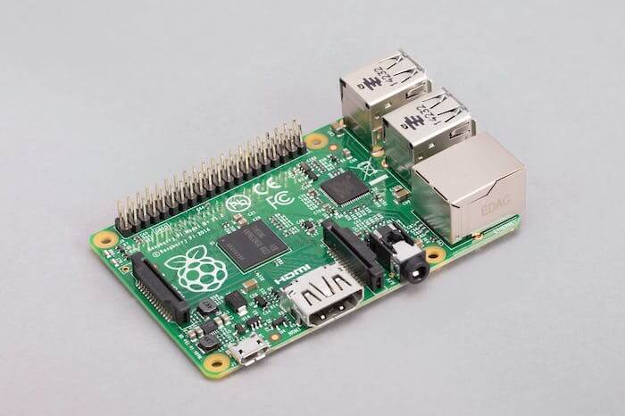

## 前言

最近搞了几个比较大的项目，github的免费套餐有点吃不消，所以就一直想着弄个别的git服务器。但是由于最近我正在给服务做《断舍离》，所以现在我之前买的公网服务器都被我鲨了。这时候我就想到自己手里不是还有一个低功耗Linux设备——树莓派吗。于是我就想到用树莓派挂载一个USB的移动硬盘，来当做自己的私有服务器。

我的树莓派是初代树莓派B+款，2014年生产，距今已经8年了。当年这东西我花了300多块钱买的，因为当时一个体积这么小但是却可以运行完整的Linux系统的设备，也是非常的稀有。他的性能很差，cpu主频只有700mhz，但是功耗还是比较低的，用一个5v2a的电源就能轻松带起。



之所以要把西开通塞进USB设备，是因为正常树莓派的系统是装到TF卡里的，但是TF卡的读写又慢，而且长期的读写很容易导致内存卡损坏。所以我就想着用USB挂一个移动硬盘来当做系统盘，虽然USB2.0的读写不高，但是至少可以防止存储挂掉。同时早期的树莓派并不直接带有USB引导功能，所以我在搭建的过程中也踩了不少坑。

## 前期准备

**本文内容仅在树莓派1B+版本进行测试使用，其他平台请自行测试**

 - 一张容量>2G的TF卡(因为系统容量是1.9G，容量不足烧录不进去)
 - 一个USB存储设备(推荐用USB的固态硬盘，相对来说更稳定一点)
 - 一台电脑

## 操作过程

首先在官网下载安装官方的系统烧录工具。

[https://www.raspberrypi.com/software/](https://www.raspberrypi.com/software/)

然后插上你准备好的TF卡，打开烧录工具，先选择擦除烧录一次，之后再选择`Raspberry Pi OS (Legacy)`(注意Debian版本`Debian version: 10 (buster)`)进行烧录。

**经测试`Debian version: 11 (bullseye)`的版本无法正常引导，不清楚是我这里设备的问题还是操作错误，总之我只确定buster是可用的**

**由于TF卡只有2G所以我选择了Lite版，也就是没有桌面环境的最小化系统。TF卡容量大的可以自行选择**

烧录好之后，因为烧录工具会自动卸载设备，所以需要将TF卡从电脑拔出，然后再插入。这时可以看到有一个名叫`boot`的256m大的分区。在分区内创建文件命名为`SSH`，然后将TF卡从电脑中卸载，插入树莓派，启动开机。这里创建文件是为了默认启动SSH服务，使你可以在开机后通过SSH远程控制计算机。

当树莓派启动后，并切可以通过SSH连入系统后，使用`sudo shutdown -h now`将树莓派关机，然后拔出TF卡。将TF卡连接到电脑上，然后将USB存储设备也连接到电脑上。

使用磁盘管理工具对磁盘进行克隆，我这里使用的是`傲梅分区助手`，如果你有其他的类似软件也可以。将TF卡的磁盘直接克隆到USB存储设备上，这时可以看到TF卡和USB存储设备会各有一个256m大小的名字为`boot`的分区，以及一个大小为2G的分区(USB存储设备应该会有未使用空间)。

将两个设备都从电脑中卸载，然后TF卡和USB存储设备都插入树莓派，启动开机。开机后使用SSH连接到树莓派。

执行如下命令
```shell
sudo blkid
```

这时终端中应该输出了类似如下的内容
```shell
/dev/mmcblk0p1: LABEL_FATBOOT="boot" LABEL="boot" UUID="8551-82D5" TYPE="vfat" PARTUUID="f7403228-01"
/dev/mmcblk0p2: LABEL="rootfs" UUID="aea57068-3f8a-462e-842c-b210b2d9c7ea" TYPE="ext4" PARTUUID="f7403228-02"
/dev/sda1: LABEL_FATBOOT="boot" LABEL="boot" UUID="8551-82D5" TYPE="vfat" PARTUUID="087a1744-01"
/dev/sda2: LABEL="rootfs" UUID="aea57068-3f8a-462e-842c-b210b2d9c7ea" TYPE="ext4" PARTUUID="087a1744-02"
/dev/mmcblk0: PTUUID="f7403228" PTTYPE="dos"
```
这里显示的是你的磁盘设备的UUID，`/dev/mmcblk0p1`和`/dev/mmcblk0p2`就是你TF卡的两个分区，而`/dev/sda1`和`/dev/sda2`就是你的USB存储设备的两个分区。我们要记录一下`/dev/sda2`分区后面显示的`PARTUUID`，这里我的UUID是`087a1744-02`。

然后使用`nano`打开`/boot/cmdline.txt`文件

```shell
sudo nano /boot/cmdline.txt
```

这里编辑的是引导命令，内容应该类似下面

```shell
console=serial0,115200 console=tty1 root=PARTUUID=f7403228-02 rootfstype=ext4 fsck.repair=yes rootwait
```

可以看到这里有一个`root=PARTUUID=f7403228-02`，根据上面的输出我们知道这个`PARTUUID`是指向了TF卡的第二个分区，我们修改这个值，将`f7403228-02`修改为USB存储设备对应的UUID，这里我需要修改为`087a1744-02`，修改结果如下。

```shell
console=serial0,115200 console=tty1 root=PARTUUID=087a1744-02 rootfstype=ext4 fsck.repair=yes rootwait
```

然后**ctrl + x**保存文件。

之后使用`nano`打开`/etc/fstab`文件

```shell
sudo nano /etc/fstab
```

这里编辑的是磁盘挂载文件，内容应该类似下面

```shell
proc                    /proc           proc    defaults          0       0
PARTUUID=f7403228-01    /boot           vfat    defaults          0       2
PARTUUID=f7403228-02    /               ext4    defaults,noatime  0       1
# a swapfile is not a swap partition, no line here
#   use  dphys-swapfile swap[on|off]  for that
```

也将其中的`f7403228-02`替换成对应的UUID，这里我替换成`087a1744-02`，修改结果如下。

```shell
proc                    /proc           proc    defaults          0       0
PARTUUID=f7403228-01    /boot           vfat    defaults          0       2
PARTUUID=087a1744-02    /               ext4    defaults,noatime  0       1
# a swapfile is not a swap partition, no line here
#   use  dphys-swapfile swap[on|off]  for that
```

然后**ctrl + x**保存文件。

然后`sudo reboot`重启，就完成了从USB存储设备启动的设置了。

但是这是USB存储设备只使用了2G的空间，这肯定是不够用的。所以我们需要扩展一下存储空间。

进入`raspi-config`

```shell
sudo raspi-config
```

选择`Advanced Options`然后回车，选择第一项`Expand Filesystems Ensures that all of the SD card storage is available`，回车确认，回车重启系统。

系统重启后磁盘的容量就是正常的容量了，可以运行`df -h`检查，输出内容如下。

```shell
Filesystem      Size  Used Avail Use% Mounted on
/dev/root       221G  1.5G  210G   1% /
devtmpfs        183M     0  183M   0% /dev
tmpfs           216M     0  216M   0% /dev/shm
tmpfs           216M   14M  202M   7% /run
tmpfs           5.0M  4.0K  5.0M   1% /run/lock
tmpfs           216M     0  216M   0% /sys/fs/cgroup
/dev/mmcblk0p1  253M   49M  204M  20% /boot
tmpfs            43M     0   43M   0% /run/user/1000
```
可以看到我的`/dev/root`的容量已经是221G了。

之后可以再把TF卡的第二分区和USB存储设备的第一分区删除掉，不过因为我比较懒而且怕出问题，所以就还是放着没有管。

## 画外音

最开始我想的是使用机械硬盘启动，结果折腾来折腾去，突然这块机械硬盘就决定原地去世，于是我只能掏出来之前的一块拆机固态换到了硬盘盒里面，但是固态确实要比机械盘稳定。机械盘有可能会因为供电问题启动不起来，但是用固态就一帆风顺了。<span class="YT-FOW">心疼逝去的硬盘</span>