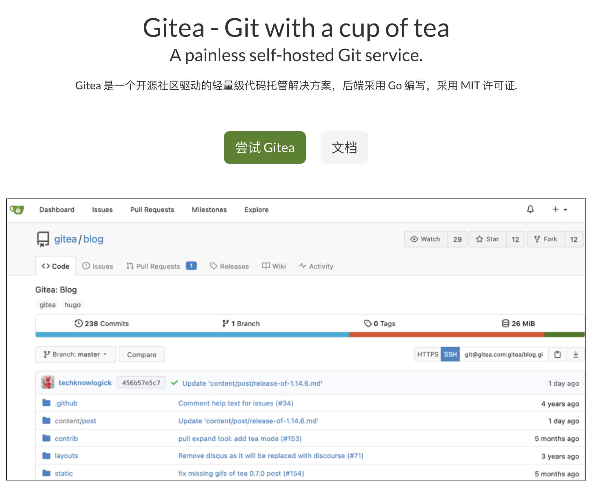
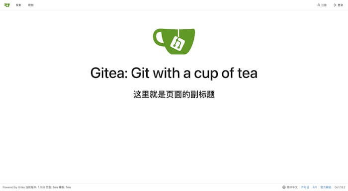

## 前言
由于我之前提到过，想要[用树莓派自己搭建一个Git的服务](/post/23/)，于是我就去找了一下各种Git的服务端，最后就发现了这个使用go开发的Git服务端——Gitea。

>Gitea的首要目标是创建一个极易安装，运行非常快速，安装和使用体验良好的自建 Git 服务。我们采用Go作为后端语言，这使我们只要生成一个可执行程序即可。并且他还支持跨平台，支持 Linux, macOS 和 Windows 以及各种架构，除了x86，amd64，还包括 ARM 和 PowerPC。



因为是用Go开发，Gitea的主要程序就是一个原生的二进制可执行文件，而且Gitea可以使用SQLite当做数据库，这样它的资源占用比Gitlab这种Java开发需要虚拟机的要少的多，甚至他在官网上就写着用树莓派就能运行，这不是巧了吗。

> - 最低的系统硬件要求为一个廉价的树莓派
> - 如果用于团队项目，建议使用 2 核 CPU 及 1GB 内存

而且由于是Go开发，所以环境搭建就容易的很多了。

## 搭建过程

首先先去官网下载平台对应的二进制文件。

[https://dl.gitea.io/gitea](https://dl.gitea.io/gitea)

直到这篇文章撰写时，最新的版本为**1.16.8**，而我是准备运行在树莓派上的，他的cpu架构是arm6，所以最后我下载的文件为`gitea-1.16.8-linux-arm-6`，下载后更名为`gitea`，然后传入服务器中。

将二进制文件移动到`/usr/local/bin/gitea`，并使用`chmod +x`添加运行权限。

这个操作也可以在服务器环境通过下面的命令执行，记得换成你对应平台的文件的地址。

```shell
wget -O gitea https://dl.gitea.io/gitea/1.16.8/gitea-1.16.8-linux-arm-6
chmod +x gitea
sudo mv gitea /usr/local/bin/gitea
```

由于我们搭建的是Git服务器，所以需要提前安装好git，并且**git版本要大于20**，这里不同的系统可以用不同的包管理器来安装，这里贴出官方给出的不同系统下的安装方式。

> ### Debian/Ubuntu
> For the latest stable version for your release of Debian/Ubuntu
> 
> `# apt-get install git`
> For Ubuntu, this PPA provides the latest stable upstream Git version
> 
> `# add-apt-repository ppa:git-core/ppa # apt update; apt install git`
> ### Fedora
> `# yum install git (up to Fedora 21)`
> 
> `# dnf install git (Fedora 22 and later)`
> ### Gentoo
> `# emerge --ask --verbose dev-vcs/git`
> ### Arch Linux
> `# pacman -S git`
> ### openSUSE
> `# zypper install git`
> ### Mageia
> `# urpmi git`
> ### Nix/NixOS
> `# nix-env -i git`
> ### FreeBSD
> `# pkg install git`
> ### Solaris 9/10/11 ([OpenCSW](https://www.opencsw.org/))
> `# pkgutil -i git`
> ### Solaris 11 Express
> `# pkg install developer/versioning/git`
> ### OpenBSD
> `# pkg_add git`
> ### Alpine
> `$ apk add git`
> 
> Red Hat Enterprise Linux, Oracle Linux, CentOS, Scientific Linux, et al.
RHEL and derivatives typically ship older versions of git. You can [download a tarball](https://www.kernel.org/pub/software/scm/git/) and build from source, or use a 3rd-party repository such as the [IUS Community Project](https://ius.io/) to obtain a more recent version of git.
> ### Slitaz
> `$ tazpkg get-install git`

安装好git之后，可以使用`git --version`检查一下版本是否大于20。

接下来的操作，官方的中文文档里有缺失，我一开始也踩了坑，然后照着英文版的文档做才成功搭建。

首先创建一个用户Gitea运行的用户，Gitea是不允许使用root用户运行的。
```shell
adduser \
   --system \
   --shell /bin/bash \
   --gecos 'Git Version Control' \
   --group \
   --disabled-password \
   --home /home/git \
   git
```

然后创建需要使用的目录和文件。

```shell
mkdir -p /var/lib/gitea/{custom,data,log}
chown -R git:git /var/lib/gitea/
chmod -R 750 /var/lib/gitea/
mkdir /etc/gitea
chown root:git /etc/gitea
chmod 770 /etc/gitea
chown root:git /etc/gitea
chmod 770 /etc/gitea
touch /etc/gitea/app.ini
chown root:git /etc/gitea/app.ini
chmod 770 /etc/gitea/app.ini
```

接下来，将服务文件[gitea.service](https://github.com/go-gitea/gitea/blob/main/contrib/systemd/gitea.service)复制到`/etc/systemd/system/gitea.service`，这里如果懒也可以直接复制我下面的精简版（**如果需要使用第三方数据库，请自行查看配置文件，并取消对应数据库的注释**）。
```ini
[Unit]
Description=Gitea (Git with a cup of tea)
After=syslog.target
After=network.target

[Service]

RestartSec=2s
Type=simple
User=git
Group=git
WorkingDirectory=/var/lib/gitea/

ExecStart=/usr/local/bin/gitea web --config /etc/gitea/app.ini
Restart=always
Environment=USER=git HOME=/home/git GITEA_WORK_DIR=/var/lib/gitea

[Install]
WantedBy=multi-user.target
```

接下来就是设置开机自启和启动服务了。

```shell
sudo systemctl enable gitea
sudo systemctl start gitea
```

然后服务应该就会在`3000`端口运行了（使用服务运行默认是在3000端口，如果需要修改端口，要在服务配置的命令中加上`--install-port 端口号`），从浏览器访问`IP:3000`来打开安装页面。

安装页面有中文，很简单，对着选就行了，我这里数据库选**SQLite**。


在这里可以修改端口，等下安装好之后，重启就是新的端口了。如果SSH端口不填的话就是关闭SSH功能，我的机器因为准备做内网穿透，所以不准备用SSH了，我就关了。

## 个性化

我们的服务配置里面，把Gitee的资产文件都放在了`/var/lib/gitea`目录中，这个目录下面有三个子目录`custom`，`data`和`log`，分别存放着自定义内容，数据，以及日志。而我们想要做个性化，就需要修改`custom`里面的文件。

关于`custom`目录，里面的`public`目录里的内容，会在服务启动后，被路由到网站的根目录下面。也就是说如果你有一些自定义的图片，样式，脚本什么的，都应该放在这里面。

安装好Gitee服务后，打开主页，我们看到的是默认的样式，虽然Gitee比较简洁，但是也是提供了一些类似主题修改的个性化功能的。

### 添加主题
首先先说主题的修改，Gitee的主题读取的策略是首先需要你在配置文件里面添加可选择的主题列表，之后再去`custom/public/css`目录中，读取`theme-主题名.css`的样式文件。所以如果你下载了新的主题或者自定义了一些CSS样式，那么你需要这样做。

我们假设主题的名字叫做**test**首先将你的CSS样式重命名为`theme-test.css`，然后将他放入`custom/public/css`目录中。

之后打开配置文件`/etc/gitea/app.ini`，在`[ui]`字段下面（如果没有请手动添加），修改`THEMES`字段，加入**test**主题，如下。
```ini
...
[ui]
# 这里gitea是默认主题，arc-green是默认暗黑主题
THEMES = gitea,arc-green,test 
...
```

保存重启服务之后，在用户登陆后的主题设置里面，就可以看到**test**的主题可供选择了。

### 修改默认主题

如果你想要用户在未登录，或者是新用户默认情况下就设置为某个主题，你需要这么做。

首先按照上文所说，将你的主题加入到可选择列表中，例如上文中的**test**主题。然后修改配置文件的`[ui]`字段，在下面加入`DEFAULT_THEME`，值等于你想选择的默认主题，如下。
```ini
...
[ui]
THEMES = gitea,arc-green,test
# 这里将默认主题设置为了test
DEFAULT_THEME = test 
...
```

保存重启服务之后，打开首页就可以看到在未登录的时候，主题设置成了**test**。

### 修改页面样式

在默认的首页样式中，我们可以看到除了我们的网站名字以外，还有一些默认的文字和图案内容。比如`一款极易搭建的自助 Git 服务`，`易安装，跨平台，轻量级，开源化`等等。想要修改这些内容，你需要这样做。


首先需要下载Gitea的源代码。

[https://dl.gitea.io/gitea/1.16.8/gitea-src-1.16.8.tar.gz](https://dl.gitea.io/gitea/1.16.8/gitea-src-1.16.8.tar.gz)

下载完成解压之后，我们可以在里面找到`templates`，这里面放着的就是全部页面的默认模板。我们可以将这个目录复制到`custom`目录下，然后修改这里面的模板，这样在服务启动后，Gitea就会优先读取`custom`目录下我们修改过的模板。当然，实际上你只需要保留你修改过的模板文件在`custom`目录里就好。

我们这次是要修改首页的内容，我们打开`custom/templates/home.tmpl`，修改一下里面的内容。
```html
{{template "base/head" .}}
<div class="page-content home">
	<div class="ui stackable middle very relaxed page grid">
		<div class="sixteen wide center aligned centered column">
			<div>
				
			</div>
			<div class="hero">
				<h1 class="ui icon header title">
					{{AppName}}
				</h1>
				<h2>这里就是页面的副标题</h2>
			</div>
		</div>
	</div>
	<!-- 注释掉不想要的内容
    <div class="ui stackable middle very relaxed page grid">
		<div class="eight wide center column">
			<h1 class="hero ui icon header">
				{{svg "octicon-flame"}} {{.i18n.Tr "startpage.install"}}
			</h1>
			<p class="large">
				{{.i18n.Tr "startpage.install_desc" | Str2html}}
			</p>
		</div>
		<div class="eight wide center column">
			<h1 class="hero ui icon header">
				{{svg "octicon-device-desktop"}} {{.i18n.Tr "startpage.platform"}}
			</h1>
			<p class="large">
				{{.i18n.Tr "startpage.platform_desc" | Str2html}}
			</p>
		</div>
	</div>
	<div class="ui stackable middle very relaxed page grid">
		<div class="eight wide center column">
			<h1 class="hero ui icon header">
				{{svg "octicon-rocket"}} {{.i18n.Tr "startpage.lightweight"}}
			</h1>
			<p class="large">
				{{.i18n.Tr "startpage.lightweight_desc" | Str2html}}
			</p>
		</div>
		<div class="eight wide center column">
			<h1 class="hero ui icon header">
				{{svg "octicon-code"}} {{.i18n.Tr "startpage.license"}}
			</h1>
			<p class="large">
				{{.i18n.Tr "startpage.license_desc" | Str2html}}
			</p>
		</div>
	</div>
  -->
</div>
{{template "base/footer" .}}
```

修改完成后，保存重启，就可以看到页面的样式已经改变啦。



## 结语

虽然Gitea很多配置还要修改文件+重启服务，可能没有那么方便，但是他较小的资源占用和性能需求，拿来当做个人使用的服务的话还是比较适合的。

前几天[Gitee称因为需要审查，迫于无奈下架了大量的开原仓库](https://www.51cto.com/article/709488.html)的事件引发了轩然大波，作为一个普普通通的小开发者，我对这个事件也没有什么评价。我所能做的就是再多搭建一个平台，用来保存我那些“可能也没什么价值”的源码罢了。毕竟都说不要把鸡蛋装在一个篮子里，而现如今最大的篮子就是Github，但是谁又能保证这个篮子不会破呢？