## 前言

最近把家里面的各种旧设备卖了一大批，什么采集卡、路由器还有游戏主机等等。结果就想着要不给显卡也卖了好了，换个性能好一点的矿卡。现在1650s拿来跑一些大点的游戏确实不太行了，后面如果要是换4k屏就更吃力了。去网上找了一圈，发现有一个叫**卡诺基**的牌子专门做矿卡翻新，还带2年保修，虽然比直接买矿卡要贵点但是感觉比较容易安全下车，于是就决定去搞了一块。

## 产品选择

我这次选择的是**2060 Super**，卡诺基官方价格999块钱，用了点优惠差不多980块钱。我选的是涡轮扇版本，虽然2060s并没有涡轮扇公版，不过我个人就本来就喜欢一些非主流的产品，而且涡轮扇版本真的很好看。

## 收货开箱

拆掉快递拿到盒子，首先想吐槽的就是这盒子都没用胶带封住，直接就可以打开的。其次就是这盒子上同时印了英伟达和AMD的标，显卡用这样的盒子真的太草了。

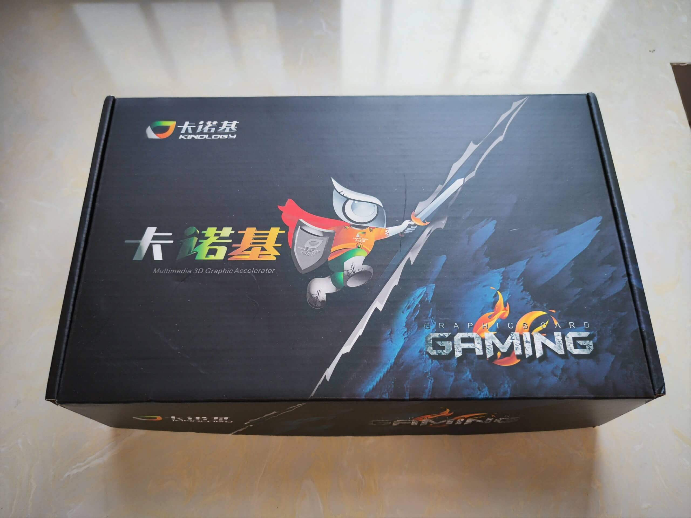

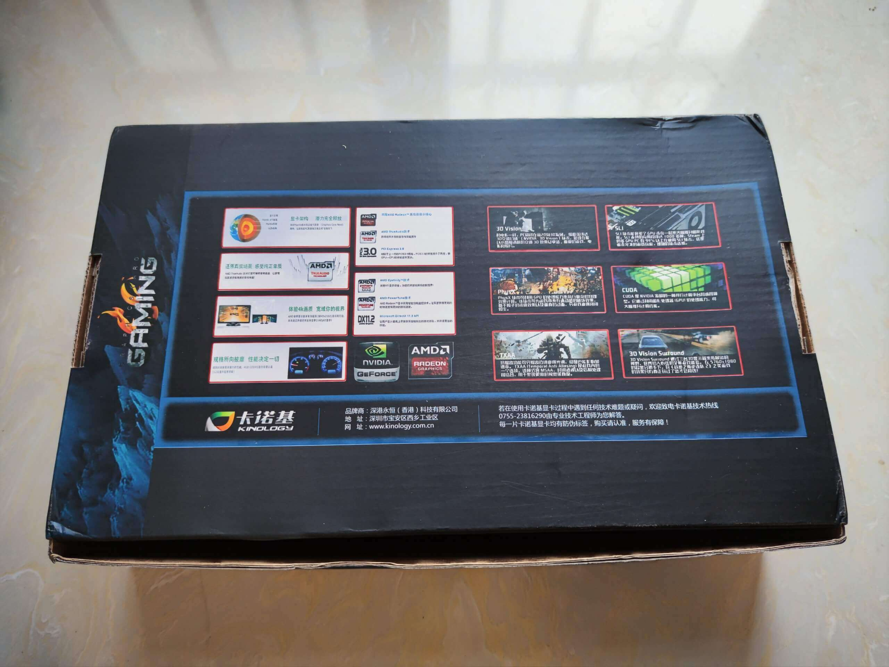

打开盒子，里面很简单，就一张说明书，一个保护海绵，一个静电袋，里面是显卡本体。~~说好的AN合体驱动盘呢？~~

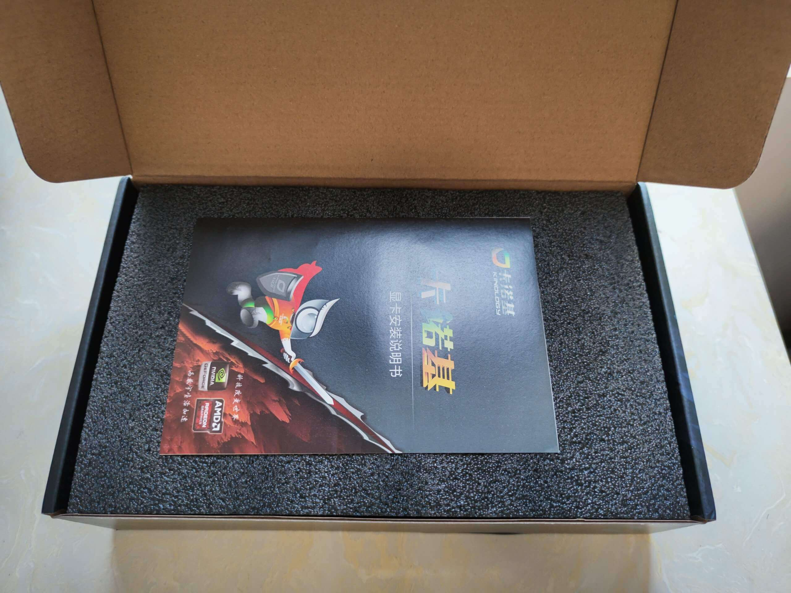

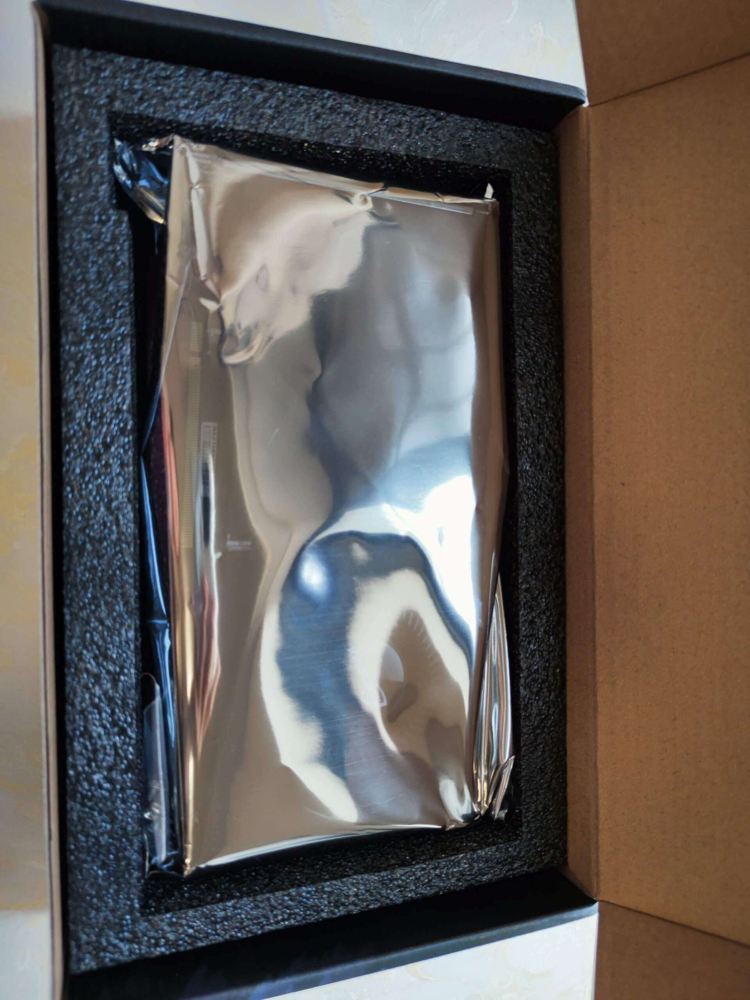

显卡拿出来，正面是整流罩和涡流扇，背面没有保护板，可以看到板子洗的很干净，看起来还可以。

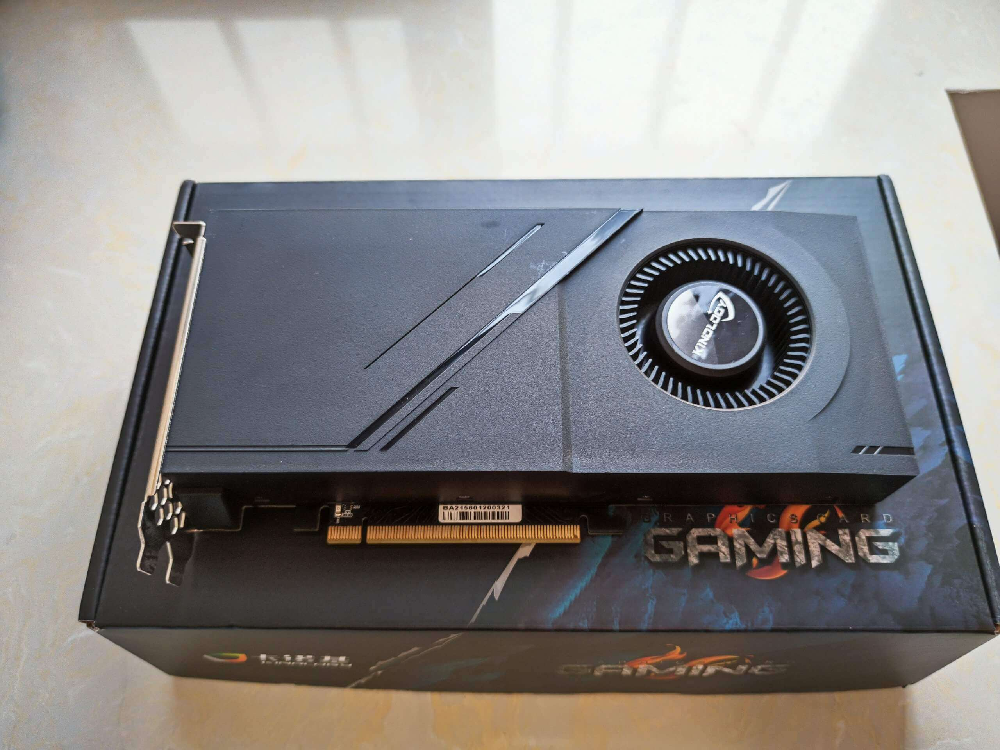

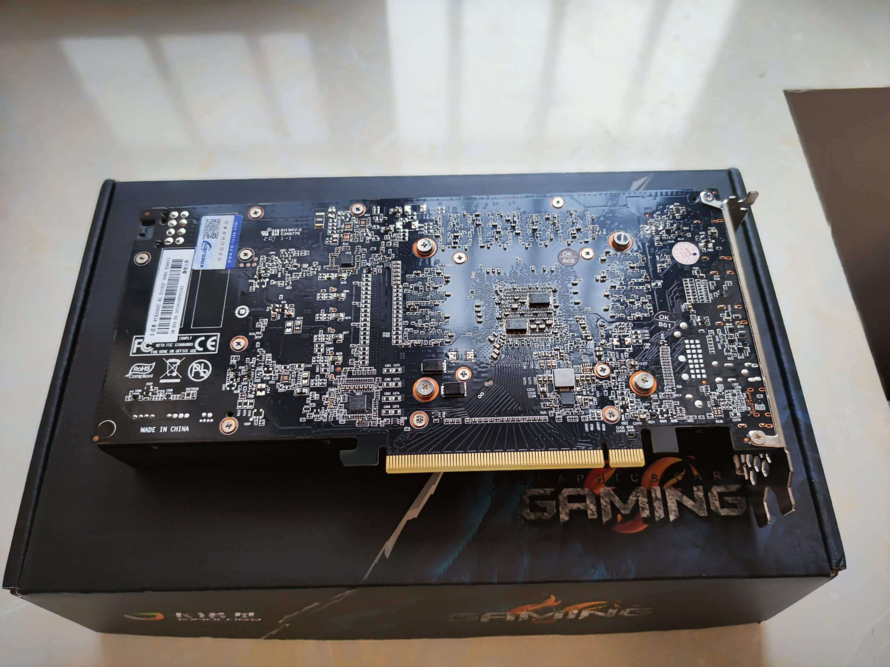

接口的话，三个DP一个HDMI。

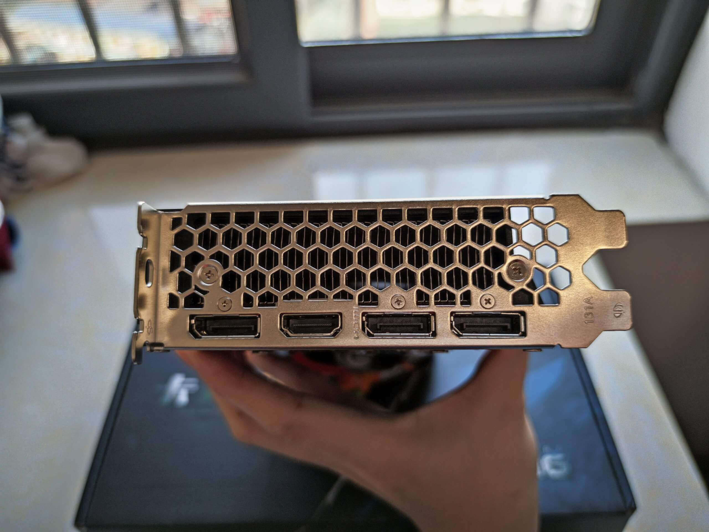

上机之后可以看到侧面的字符，虽然塑料看起来有点廉价，但是整体比较板正，还算可以吧。

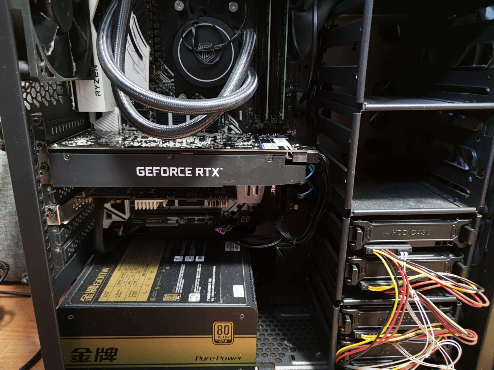

## 上机测试

在GPU-Z和NVIDIA Inspector里都能看到，TU106的核心，8G的显存，确实是正经2060s而不是什么妖魔鬼怪。时钟频率在1470，据说卡诺基的bios都是这个数，估计是为了稳定性调的，虽然低了一点，但是也够用。

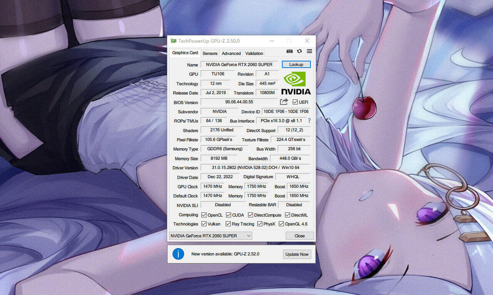

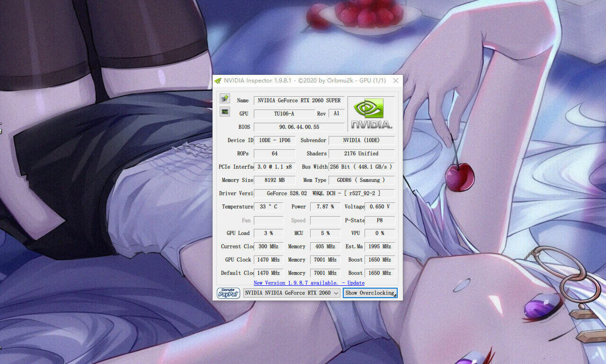

象征性的甜甜圈烤了一会鸡，15分钟，温度保持在76度，帧数240+，没啥问题。

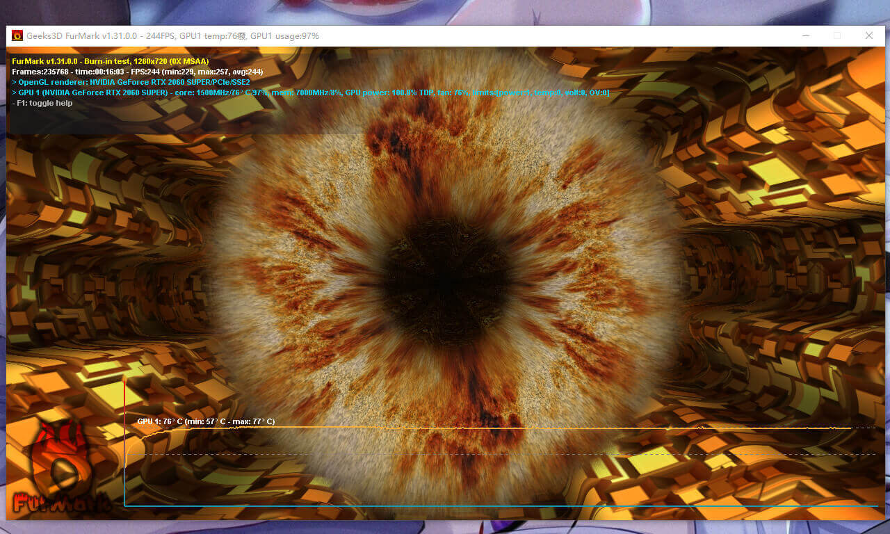

娱乐大师跑一下分，结果是271011，在2060s的跑分里算比较低的，估计和bios限制频率有关。

TimeSpy跑一下分，结果8201，和鲁大师一样，在2060s里算比较低。

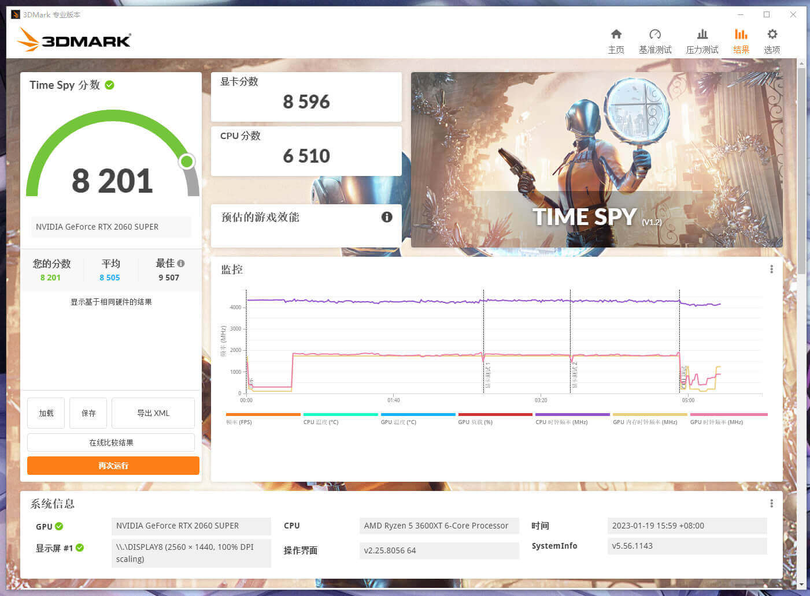

最后用TimeSpy跑一下稳定性测试，结果98%，可以通过测试没啥问题。

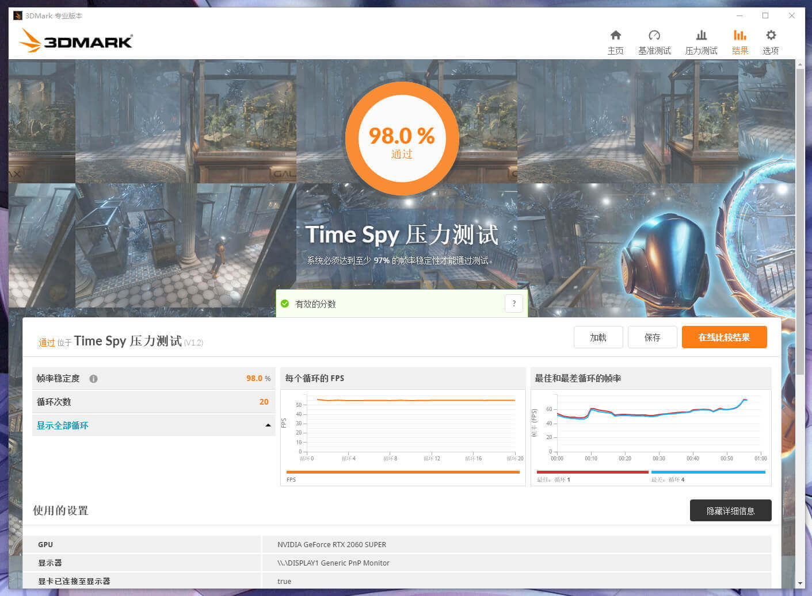

## 游戏测试

最近完全没玩游戏！有空再说吧！

## 总结

还算能买，看起来没啥问题，不过还是不推荐需求比较高的或者能力有限的人来买。